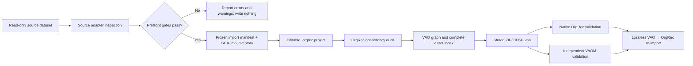

# Converting existing audio datasets to VAO

Status: authoritative OrgRec implementation and preservation guidance for VAO
0.2. The VAO container and semantic requirements remain normative in
[`VAO_STANDARD.md`](VAO_STANDARD.md); this document defines the conversion
workflow used by OrgRec and the requirements for adding another source adapter.

## 1. Purpose

An existing audio dataset is rarely only a set of audio files. Meaning may be
distributed across filenames, directory names, organ definition files,
spreadsheets, database keys, screenshots, README files, licenses, application
configuration, or undocumented conventions. Conversion to VAO must recover as
much of that structure as the evidence supports while preserving every source
byte needed to audit or reinterpret the result.

Conversion is therefore not transcoding. OrgRec does not merely put WAV files
in a ZIP and rename it `.vao`. It performs five distinct operations:

1. preserve and checksum the supplied source;
2. interpret the source through an explicit adapter or mapping profile;
3. create an editable, evidence-bound OrgRec project model;
4. project that model and its complete payload into the VAO graph;
5. validate and losslessly re-import the finished VAO.

The result is a new representation of the source dataset. It is not proof that
the represented organ identity, historical claims, tuning, recording context,
or rights are complete merely because the package validates.

## 2. Core conversion invariants

Every OrgRec source adapter and conversion run follows these invariants.

### 2.1 Source preservation

- Source files are read-only inputs.
- Audio masters are copied without sample conversion, normalization, trimming,
  denoising, relabeling, or metadata rewriting.
- A SHA-256 inventory is frozen before or during import.
- Each copied file is hashed again; a mismatch aborts the import.
- The import is written to a new destination and never overwrites the source.
- A partially created destination is removed after failure.
- Source documentation, definitions, images, licenses, and relationship files
  needed to understand or execute the dataset are retained, not only WAV files.

### 2.2 Evidence preservation

- The source value and source location survive every semantic interpretation.
- Parsed labels never erase filename tokens, ODF selectors, record IDs, or raw
  values.
- Inferred facts are marked as inferred or as analysis priors.
- Missing values remain missing.
- Conflicts and irregular structures are represented, not silently repaired.
- One physical asset may represent several logical components; conversion does
  not duplicate bytes merely to make the logical model look one-to-one.

### 2.3 Identity safety

- Existing canonical identifiers are retained only when the source and
  governing authority justify them.
- A local number, filename prefix, application ID, or checksum is never labeled
  as an MDVS identifier merely because OrgRec requires a grouping key.
- Unreconciled objects receive an explicit source-bound identity.
- A later canonical reconciliation adds an external identity assertion; it does
  not rewrite the evidence trail or pretend the canonical ID was known earlier.

### 2.4 Rights safety

- Absence of a license never means permission.
- Supplied license files are retained as payload evidence.
- Recognized license URIs, rights holders, statements, access conditions, and
  credit lines are represented in the VAO manifest when supported by the source.
- Unknown or conflicting rights remain explicit review findings.
- Successful technical validation does not authorize publication.

### 2.5 Reversibility

- The `.orgrec` working package is embedded losslessly under `payload/orgrec/`.
- Every payload file is indexed with byte size and SHA-256.
- A finished OrgRec-profile VAO must recreate the editable project without
  changing the project identity or any source payload byte.
- The public VAO graph remains usable by implementations that do not understand
  OrgRec's private `project.json`.

## 3. Conversion architecture



The adapter is the only source-specific stage. Project persistence, VAO graph
construction, asset indexing, container writing, validation, and re-import are
shared implementation paths.

## 4. Source-adapter classes

OrgRec currently demonstrates two adapter classes.

### 4.1 Structured-descriptor adapter

A structured descriptor explicitly connects controls or components to audio.
The GrandOrgue adapter uses a selected `.organ` ODF. It can reconstruct manual
and pedal compasses, stops, split ranges, pipe mappings, shared references,
couplers, and tremulants from source-native relationships.

This is the preferred case because semantic relationships are source evidence,
not guesses from filenames. The descriptor itself must be preserved and linked
as source evidence.

### 4.2 Convention/profile adapter

A convention adapter applies an explicit, reviewable rule to an otherwise
unstructured collection. OrgRec's audio-dataset wizard recognizes four common
filename shapes:

- `<stop>_<midi>[_variant].wav`;
- `<record>_<stop>_<midi>[_variant].wav`;
- `<midi>_<stop>[_variant].wav`;
- `<stop>_<note-name>[_variant].wav`, using scientific note names such as `C4`.

Underscores, spaces, and hyphens may delimit fields. WAV/WAVE, AIFF, CAF, and
FLAC source files are read through Core Audio and preserved without
transcoding. A reviewed dataset-level offset can translate ordinal key numbers
to MIDI positions; both the raw filename token and interpreted MIDI value are
retained. Variant suffixes should be explicit (`rr2`, `v2`, or `take2`).

The wizard inventories candidate filenames before parsing, reports unmatched
files, groups every observed stop token, and requires a human-reviewed label
and footage mapping for each group. Footage determines only an expected
sounding-pitch analysis prior. It is not a canonical stop assertion.

This evidence is less authoritative than a structured descriptor. Conversion
therefore retains the token, filename, profile, offset, interpretation note,
and `sourceBound` trust state. The fixed PositivXR profile remains a worked
specialization; see [`POSITIVXR_CASE_STUDY.md`](POSITIVXR_CASE_STUDY.md).

GrandOrgue is deliberately not routed through this convention adapter. Its ODF
is a structured descriptor and controls mappings in the separate GrandOrgue
wizard and converter.

### 4.3 Required adapter output

Regardless of input format, an adapter must produce enough information to form:

- a stable source identity and source record locator;
- an instrument label and known contextual labels;
- a component hierarchy or explicit statement that one is unavailable;
- one logical position/control mapping per imported observation;
- a safe local path for every required asset;
- technical audio metadata without altering the file;
- an inventory of ignored, unreferenced, missing, conflicting, or unsupported
  material;
- source URLs, license evidence, and modeling notes when available;
- a frozen import manifest that can reproduce the interpretation.

An adapter must fail rather than invent a mapping when two plausible
interpretations cannot be distinguished.

## 5. Detailed conversion lifecycle

### Phase 0 — establish scope and authority

Before conversion, identify:

- the supplied source boundary;
- which structural definition or mapping profile is authoritative for this run;
- whether original and extended variants coexist;
- whether redistribution of audio and documentation is permitted;
- whether external dependencies are required;
- whether source paths or documentation contain personal, restricted, or
  security-sensitive information.

Selecting one definition is a modeling decision. Other definitions may remain
preserved as source evidence without controlling the converted disposition.

### Phase 1 — acquire and authenticate the source

Record the publisher or repository URL, download date, advertised checksum, and
actual checksum when available. Archive extraction happens outside the VAO
parser. Password-protected, encrypted, or policy-restricted content is not
bypassed.

The source archive may be retained as acquisition evidence, but the extracted
self-contained tree is the conversion input when relationships are relative to
files in that tree.

### Phase 2 — perform a read-only inspection

Inspection occurs before the destination project exists. It should report:

- selected descriptor and detected text encoding;
- instrument, venue, builder, date, and recording statements;
- divisions, compasses, components, controls, and logical positions;
- logical audio references and unique physical audio files;
- payload file count and byte size;
- media formats and inconsistencies;
- rights and source links;
- ignored, unreferenced, missing, unsafe, cyclic, or unreadable items;
- all adapter interpretations and remaining unknowns.

Warnings allow conversion when uncertainty can be represented honestly. Errors
block conversion when the resulting project would be internally broken or
unsafe.

### Phase 3 — normalize syntax, not evidence

The adapter may normalize syntax to interpret it:

- decode a documented or detected legacy text encoding;
- convert backslashes to internal forward-slash path components;
- remove a leading `./` or `.\\`;
- normalize section/field numbers for lookup;
- merge explicitly contiguous ranges of the same stop;
- resolve source-native references recursively.

The source file itself is not rewritten. The detected encoding, raw field,
source selector, reference target, and resolved path are recorded so the
normalization remains auditable.

Absolute paths, `..`, empty path components, NULs, cyclic references, missing
targets, and unreadable required audio are not normalized away. They are errors.

### Phase 4 — assign instrument identity

Three identities must be kept separate:

| Identity | Purpose | Example |
| --- | --- | --- |
| VAO ID | identifies one immutable exchange revision | `urn:uuid:…` |
| VAO primary entity ID | identifies the instrument node inside this OrgRec project graph | `urn:uuid:<project UUID>` |
| external/source identity | reconnects the primary entity to the source system or authority | `SOURCE:grandorgue:<ODF SHA-256>` |

A source-bound identifier uses the VAO source-bound identifier scheme. A
publisher URL can be its `resolvesTo`. It is not put in the MODAVIS/MDVS scheme.
If an authoritative MDVS identity is later established, it is added separately.

### Phase 5 — build the component and interaction graph

The adapter maps structural evidence to OrgRec components. In a pipe-organ audio
dataset this commonly includes:

- divisions or keyboards;
- stops or ranks;
- pipe/logical key positions;
- couplers, tremulants, and other accessories;
- isolated-stop configurations;
- control interactions.

Every component locator contains the organ identity, source record, source path
or selector, frozen manifest hash, kind, label, and trust state. Parent links
connect pipe positions to stops and stop/control components to the instrument.

For playable GrandOrgue conversions, stop and coupler interactions use
`vao:activates`; tremulants use `vao:modulates`. The preserved ODF remains the
complete execution contract for advanced MIDI assignments, enclosure curves,
combination systems, and display geometry.

### Phase 6 — model logical observations and physical files

OrgRec creates one roadmap item and imported take for every logical audio
mapping, not necessarily for every unique file. This distinction is essential:

```text
logical pipe A ─┐
                ├── one preserved WAV asset
logical pipe B ─┘
```

A GrandOrgue `REF:` can deliberately reuse one sample for several logical
positions. The resulting VAO contains one asset and several take/component
relations. Duplicating the bytes would misrepresent source storage and weaken
fixity comparison.

Each imported take records:

- roadmap/component binding;
- source-relative audio path;
- sample rate, channel count, frame count, byte size, and SHA-256;
- source selector and raw mapping value;
- import provenance;
- explicit review state and reason;
- known versus unknown recording context.

The import activity timestamp is not substituted for the historical recording
date. When the latter is unknown, it stays unknown.

### Phase 7 — qualify pitch and analysis expectations

MIDI keys, filenames, or stop footage can produce an expected-frequency prior.
They do not prove tuning or temperament. OrgRec records A4=440 Hz and 12-TET as
assumptions unless supported by documentary or measurement evidence.

The usual footage offsets are:

| Nominal pitch | Analysis-prior offset from key MIDI |
| --- | ---: |
| 16′ | −12 semitones |
| 8′ | 0 semitones |
| 4′ | +12 semitones |
| 2 2/3′ | +19 semitones |
| 2′ | +24 semitones |

Later signal analysis is a new observation with method, version, confidence,
quality flags, and input binding. It never rewrites the documentary source.

### Phase 8 — freeze the import manifest

Before project creation, OrgRec serializes a source-specific manifest. Its
exact bytes become the project snapshot evidence and are SHA-256-addressed.

For GrandOrgue the file is:

`Manifests/grandorgue-source.json`

It records:

- import time and source mutation policy;
- original source directory name and path at import;
- ODF relative path, encoding, and SHA-256;
- instrument and recording statements;
- source page, license, and rights holder;
- divisions, stops, controls, logical samples, source selectors, resolved paths,
  references, and audio metadata;
- complete payload file inventory, byte sizes, and SHA-256;
- warnings.

The machine-readable shape is documented in
[`Schemas/grandorgue-import-manifest.schema.json`](../Schemas/grandorgue-import-manifest.schema.json).

Absolute source paths can reveal workstation usernames or mount names. An
OrgRec-profile VAO preserves this import evidence. A public dissemination
workflow must review or create a documented redacted derivative when local path
privacy matters; silently editing a released VAO breaks fixity and provenance.

### Phase 9 — create the editable OrgRec project

The project store creates a new `.orgrec` package with fixed subdirectories,
writes `project.json` atomically, writes the frozen source manifest, copies the
preservation payload, verifies every copied checksum, and reloads the project
through normal validation.

The project is a working model. It can be inspected, audited, analyzed, reviewed,
and exported repeatedly. A new VAO export receives a new VAO ID; the OrgRec
project and instrument-node identity remain stable.

### Phase 10 — run the OrgRec consistency audit

The audit checks project identity, frozen-manifest fixity, component locators,
roadmap/take backlinks, audio presence and hashes, technical metadata,
provenance, rights statements, review state, and analysis consistency.

An imported dataset can be VAO-exportable with review warnings. A warning about
missing historical environmental data is preferable to a fabricated value.
Blockers indicate broken identity, references, integrity, or required project
structure and must be resolved before export.

### Phase 11 — project the project into VAO

OrgRec enumerates every non-hidden regular project file except transient
`Exports/` content. Each file becomes exactly one VAO asset below
`payload/orgrec/` with:

- stable asset URN derived from its archive path;
- IANA media type;
- byte size and SHA-256;
- semantic role;
- representation status;
- subject entity links;
- original filename, creation time, encoding, and OrgRec-relative path.

The project model becomes the VAO graph:

| Source/OrgRec concept | VAO representation |
| --- | --- |
| represented instrument | primary `modinst:MusicalInstrument` / `modorgan:PipeOrgan` entity |
| source-bound or MDVS identity | typed external identifier on primary entity |
| division, stop, pipe, coupler, tremulant | component entity plus qualified membership |
| isolated stop state | configuration entity |
| logical imported observation | recording-take digital object |
| physical WAV | `audio-master` asset and `hasRepresentation` relation |
| ODF, README, license, image, HTML | `source-evidence` asset |
| import/project JSON | source-evidence or application-state asset |
| import activity | paradata processing activity |
| creator/rights holder | agent entity |
| stop/coupler/tremulant control | interaction entity plus `activates`/`modulates` relation |
| source license | VAO rights record with license URI, holder, statement, access, credit |

Directory location alone does not determine an asset's role. A PNG or ODF kept
beside original audio is source evidence; only recognized lossless audio media
receives `audio-master`.

### Phase 12 — write and validate the container

The writer creates a ZIP/ZIP64 `.vao` with uncompressed `mimetype` first,
`vao-manifest.json` second, and indexed payload entries after them. It does not
overwrite an existing destination.

Native validation checks:

- mimetype and archive order;
- safe paths and supported compression;
- VAO 0.2 version and schemas;
- profile minima;
- unique IDs and resolved graph references;
- rights and MODAVIS binding;
- exact payload/index equality;
- ZIP size, manifest size, and SHA-256 for every asset;
- case-fold collisions and preservation rules.

The independent Python VAOM validator then checks the same portable contract.
Validation by two implementations guards against a writer and validator sharing
the same mistaken assumption.

### Phase 13 — prove lossless re-import

The final acceptance test imports the VAO into a new destination. OrgRec first
validates the archive, extracts only indexed `payload/orgrec/` assets, loads
`project.json`, confirms that the VAO primary entity and project identities agree, and
stores the source VAO manifest and validation report as an audit receipt.

A file-by-file SHA-256 comparison excluding the newly created audit receipt must
show no differences from the source `.orgrec` project.

## 6. Asset roles and representation status

| Material | Typical role | Representation status |
| --- | --- | --- |
| preserved WAV/FLAC master | `audio-master` | `captured` |
| selected ODF or source database export | `source-evidence` | `authored` |
| README, license, photograph, console image | `source-evidence` | `authored` |
| OrgRec `project.json` | `application-state` | `authored` |
| source import manifest | `source-evidence` | `authored` |
| computed pitch/spectrogram report | `analysis-result` | `inferred` |
| transcoded or processed listening file | `audio-derivative` | `processed` |

Representation status describes how the digital representation arose. It does
not certify that a recording is historically authentic or that an authored ODF
is factually complete.

## 7. Errors, warnings, and review findings

| Condition | Result | Reason |
| --- | --- | --- |
| source/ODF missing or unreadable | error | no reproducible input |
| no importable audio mapping | error | would create an empty/broken project |
| absolute, traversal, NUL, or malformed path | error | package and filesystem safety |
| missing/cyclic required reference | error | logical position has no representation |
| unreadable required audio | error | technical metadata and payload cannot be verified |
| copy checksum mismatch | error and partial destination removal | source preservation failed |
| destination already exists | error | no implicit overwrite |
| duplicate logical MIDI identifier | warning or adapter error | must be represented or disambiguated explicitly |
| mixed audio formats | warning | valid but important for use and analysis |
| unknown rights | warning/review blocker for dissemination | no permission inferred |
| no canonical instrument ID | source-bound identity | conversion must remain possible without minting authority data |
| missing microphone/environment/tuning | review warning | absence is documentary information |
| source asset not used by selected definition | preserve as evidence | may belong to another co-located disposition |
| advanced control/display field not normalized | preserve in descriptor and document boundary | avoids silent loss while keeping the editable model scoped |

## 8. Security and privacy model

- Source content is data, never automatically executed.
- VAO prohibits archive traversal, absolute paths, backslashes, links, devices,
  and unindexed payload.
- External URLs are recorded but are not fetched during import or validation.
- Encrypted/DRM content is not bypassed.
- Active HTML, scripts, plugins, or binaries may be preserved as evidence but
  are not launched by opening the package.
- Source trees containing symbolic links require special review: links are not
  valid VAO assets and a preservation export must contain independent regular
  files rather than external references.
- Public release requires review of absolute source paths, personal data,
  restricted heritage locations, licenses, and source-document content.

## 9. Operator workflow and UX contract

The graphical workflow presents decisions in the order that affects their
meaning:

1. choose the adapter and the exact source descriptor or directory;
2. optionally attach the publisher/source URL;
3. inspect without creating a destination;
4. review identity, rights, selected structure, file inventory, payload size,
   warnings, and blocking failures;
5. import into a newly named editable project;
6. review the resulting project consistency findings;
7. export and validate VAO.

For a structured descriptor, the UI must not silently select the first matching
file. It must show the selected descriptor path and checksum because original,
extended, dry, wet, or surround variants can coexist. Counts must distinguish
logical mappings from unique physical audio files. The primary import action
states how many logical mappings it will create and remains disabled while a
required reference is unresolved.

Identity and rights are review data, not advanced settings. The UI shows the
source-bound nature of an unreconciled identity, explains what the optional
source URL does, and displays “not encoded” or “not detected” instead of blank
space or fabricated defaults. Warnings remain visible after import through the
project audit.

Long operations expose a working state and a concise result. Cancellation or
failure must never leave a destination that looks complete. Existing
destinations are not overwritten, and direct VAO conversion retains the
editable `.orgrec` project only when the operator explicitly supplies one.

In the GrandOrgue screen these requirements appear as six review stages:
**Select the exact ODF**, **Inventory**, **Organ identity and rights**,
**Selected disposition**, **Validation and preservation**, and **Import**. This
layout was exercised by the Bureå case: it made the original/extended choice,
295-versus-283 shared-sample distinction, CC license, complete 476-file payload,
and missing-reference gate visible before writing.

## 10. Reproducible commands

GrandOrgue structured-descriptor workflow:

```sh
swift run OrgRecDatasetTool grandorgue-inspect \
  /path/to/set/definition.organ \
  inspection.json \
  --source-url https://publisher.example/organ

swift run OrgRecDatasetTool grandorgue-vao \
  /path/to/set/definition.organ \
  Organ.vao \
  --project Organ.orgrec \
  --source-url https://publisher.example/organ

swift run OrgRecDatasetTool audit Organ.orgrec audit.json
python3 Tools/vaom.py validate Organ.vao --json
swift run OrgRecDatasetTool vao-import Organ.vao Restored.orgrec
```

Filename/profile workflow:

```sh
swift run OrgRecDatasetTool inspect /path/to/wavs inspection.json
swift run OrgRecDatasetTool import /path/to/wavs Organ.orgrec --analyze
swift run OrgRecDatasetTool audit Organ.orgrec audit.json
swift run OrgRecDatasetTool vao-export Organ.orgrec Organ.vao
python3 Tools/vaom.py validate Organ.vao --json
swift run OrgRecDatasetTool vao-import Organ.vao Restored.orgrec
```

The current generic `inspect` and `import` commands use the PositivXR profile.
A new filename convention requires a new explicit adapter/profile; it must not
be guessed automatically.

## 11. Acceptance criteria

A conversion is complete only when all applicable statements are true:

- the exact source boundary and selected structural definition are recorded;
- source acquisition and license evidence are retained;
- every required logical mapping resolves safely;
- irregular compasses, shared samples, and variants survive;
- semantic interpretations remain traceable to raw source fields;
- canonical and source-bound identities are not conflated;
- all preserved source files have SHA-256 fixity and verified copies;
- each imported take is linked to its component, configuration, source asset,
  import activity, and frozen source manifest;
- unknown provenance, rights, pitch, temperament, and environment remain
  explicitly unknown;
- the OrgRec consistency report has no blockers;
- the VAO contains a complete graph, rights record, indexed payload, and profile
  claims justified by its content;
- OrgRec and VAOM both validate the archive;
- VAO re-import recreates the project and source payload byte-for-byte;
- exclusions and remaining non-normalized semantics are documented.

## 12. Implementation traceability

The shared and adapter-specific code paths are deliberately separated:

| Responsibility | Implementation |
| --- | --- |
| GrandOrgue inspection records and frozen manifest | `Sources/OrgRecCore/GrandOrgueSampleSet.swift` |
| read-only ODF inspection | `GrandOrgueSampleSetImporter.inspect` |
| checked project creation and rollback | `GrandOrgueSampleSetImporter.importSampleSet` |
| component/roadmap/take projection | `GrandOrgueSampleSetImporter.makeProject` |
| VAO graph, asset index, container writing | `Sources/OrgRecCore/VAOPackage.swift` / `VAOPackageBuilder.build` |
| native archive validation | `VAOPackageValidator.validate` |
| lossless project restoration | `VAOPackageImporter.importPackage` |
| CLI orchestration | `Sources/OrgRecDatasetTool/main.swift` |
| separate guided macOS conversion paths | `DatasetImportView` in `Sources/OrgRecApp/ContentView.swift` |
| audio filename and mapping wizard | `AudioDatasetVAOWizard` in `Sources/OrgRecApp/DatasetConversionWizards.swift` |
| six-stage GrandOrgue-to-VAO wizard | `GrandOrgueVAOWizard` in `Sources/OrgRecApp/DatasetConversionWizards.swift` |
| portable independent validation | `Tools/vaom.py` |
| GrandOrgue evidence schema | `Schemas/grandorgue-import-manifest.schema.json` |

`grandorgue-vao` composes the same importer and VAO builder used by the separate
commands. It does not maintain a second conversion implementation. When
`--project` is omitted, the CLI uses a temporary editable project and removes
it after the validated VAO has been created; when supplied, that project is the
retained audit/editing source.

## 13. Requirements for a new source adapter

A contribution adding another existing-dataset format must include:

1. public Codable inspection and import-manifest records;
2. safe parser and path/reference resolution;
3. source identity and trust policy;
4. explicit semantic mapping and assumption notes;
5. complete payload inventory and copy verification;
6. OrgRec component, roadmap, take, provenance, rights, and characteristics
   mapping;
7. UI preflight with errors, warnings, scope, rights, and payload cost;
8. CLI inspection and conversion path;
9. JSON Schema for the frozen import manifest;
10. a miniature automated fixture covering malformed input and round-trip;
11. an end-to-end real dataset case study when redistribution permits;
12. VAOM cross-validation and a documented lossless re-import result.

The adapter must not weaken shared VAO validation or special-case the finished
archive so that only OrgRec can read it.

## 14. Worked example

The complete worked example is
[`BUREA_GRANDORGUE_VAO_CASE_STUDY.md`](BUREA_GRANDORGUE_VAO_CASE_STUDY.md).
It shows how the invariants above handle legacy encoding, Windows paths, split
stops, shared samples, source-bound identity, machine-readable rights, playable
controls, unused co-located assets, validation, and lossless re-import in one
real, redistributable dataset.
