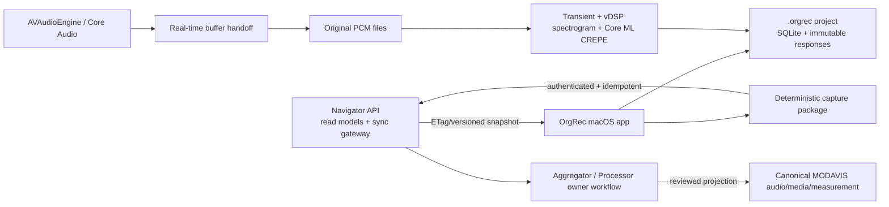

# OrgRec — macOS pipe-organ recording software intertwined with MODAVIS

Status: product and implementation proposal  
Target: native macOS, offline-first field recording  
MODAVIS binding: Release 1.1 terminal boundary, Navigator API as the application contract  
Working assumption: OrgRec does not modify the MODAVIS repositories or canonical database schemas

## Executive recommendation

OrgRec should be a field recorder, scientific notebook, and coverage tracker—not a general-purpose DAW. MODAVIS supplies the organ identity, structure, stop list, component relationships, known pitch/temperament, and source evidence. OrgRec turns that information into an actionable recording roadmap, records takes, analyzes them locally, and preserves the lineage from every result back to the exact MODAVIS snapshot and organ component that prompted it.

The user should always be able to answer four questions from one window:

1. What must be recorded next?
2. What organ state, stops, microphones, devices, and technique produced this take?
3. Did the take pass signal, transient, pitch, and documentation checks?
4. Can the result be reproduced and synchronized without overwriting either source evidence or a human correction?

The primary integration should be the future Navigator API. OrgRec keeps an immutable local cache for disconnected fieldwork. It never depends on live PostgreSQL access during a session and never writes canonical MODAVIS tables directly. Synchronization submits a validated, checksummed capture package through an authenticated API and receives an idempotent receipt; canonical projection remains an owner-governed MODAVIS operation.

## Release and schema findings

The proposal was evaluated against the parent workspace and canonical Initiator schema without modifying either.

### Critical Release 1.1 fact

The current Release 1.1 terminal state is `release_1_1_enrichment_not_justified`. Its textual-enrichment canary failed closed, so no Release 1.1 schema or corpus projection was created. The sealed 1.1 candidate exactly matches the immutable Release 1.0 database.

Accordingly, an OrgRec project must bind both:

- the requested MODAVIS release context: `1.1` and its terminal-decision receipt;
- the actual canonical source snapshot: Release 1.0 database plus protected fingerprint `70a3ff6dd2f629e6da9fb713acfe9e9358cd7db85612a9789931ded5663031c7`.

OrgRec must not imply that Release 1.1 added organ facts or tables. This dual binding should be visible in project diagnostics and stored in every export manifest.

Relevant evidence:

- [`RELEASE_1_1_TEXTUAL_ENRICHMENT.md`](../modavis-release-1.1-workspace/modavis-navigator/docs/RELEASE_1_1_TEXTUAL_ENRICHMENT.md)
- [`release-1.1-enrichment-not-justified.json`](../modavis-release-1.1-workspace/modavis-navigator/docs/release-checkpoints/release-1.1-enrichment-not-justified.json)
- [`release-1.0-private-completion.json`](../modavis-release-1.1-workspace/modavis-navigator/docs/release-checkpoints/release-1.0-private-completion.json)
- [`RELEASE_1_0_SCHEMA_DATA_DICTIONARY.md`](../modavis-release-1.1-workspace/modavis-navigator/docs/RELEASE_1_0_SCHEMA_DATA_DICTIONARY.md)

### Canonical schema baseline

The adjacent canonical Initiator checkout used for this schema evaluation is commit `20d975f1b1d9661e069cdd11579e8ef17177405e`, with database version marker `0.3.400.1.0` and schema-definition set `database/data_schemas_v0.3.0`. A production API profile should return its own schema/contract identity rather than requiring the client to infer it from a repository checkout.

Existing structures already cover much of the canonical destination model:

| Concern | MODAVIS structure | OrgRec use |
| --- | --- | --- |
| Organ identity/state | `core.entity`, `core.continuant`, `core.manifestation`, `organs.detail` | Resolve the selected organ and state; never mint an identity locally. |
| Roadmap hierarchy | `organs.component`, `organs.component_membership`, `organs.division`, `organs.stop`, `organs.rank`, `organs.pipe_position` | Build division → stop/rank → note/functional-position targets. |
| Recording context | `prov.activity`, `audio.recording_session` | Canonical destination for a finalized session. |
| Takes/channels/regions | `audio.recording_take`, `audio.channel`, `audio.segment` | Map takes, channel roles, attack, sustain, release, noise, room tone, and calibration. |
| Files and fixity | `media.asset`, `media.bitstream`, `media.storage_object`, `media.file` | Map logical assets, byte streams, locations, format, and hashes. |
| Microphones/interfaces | `core.manifestation`, `devices.microphone`, `devices.interface` | Link existing device manifestations; unresolved field devices remain local candidates. |
| Numeric observations | `measurement.observation` | Map frequency, level, timing, and uncertainty when the measured target is a canonical entity. |
| Processing history | `paradata.generic`, `softwares.software`, `types.file_process` | Record CREPE, transient detection, spectrogram generation, validation, and parameter versions. |
| Playable sample output | `sonus.sample`, `sonus.zone`, `sonus.loop` | Post-MVP projection for accepted, normalized samples only. |

Schema sources:

- [`schema_audio.yaml`](../modavis-initiator/database/data_schemas_v0.3.0/schema_audio.yaml)
- [`schema_organs.yaml`](../modavis-initiator/database/data_schemas_v0.3.0/schema_organs.yaml)
- [`schema_devices.yaml`](../modavis-initiator/database/data_schemas_v0.3.0/schema_devices.yaml)
- [`schema_measurement.yaml`](../modavis-initiator/database/data_schemas_v0.3.0/schema_measurement.yaml)
- [`schema_media.yaml`](../modavis-initiator/database/data_schemas_v0.3.0/schema_media.yaml)
- [`schema_paradata.yaml`](../modavis-initiator/database/data_schemas_v0.3.0/schema_paradata.yaml)
- [`schema_sonus.yaml`](../modavis-initiator/database/data_schemas_v0.3.0/schema_sonus.yaml)

The existing `rotarec.*` contract is a useful architectural precedent: the capture client owns operational sessions/takes/notes/sync receipts while canonical audio and media structures remain independently governed. OrgRec should copy that ownership pattern, not reuse roll-specific RotaRec tables. See [`schema_rotarec.yaml`](../modavis-initiator/database/data_schemas_v0.3.0/schema_rotarec.yaml) and [`operations_and_ownership.md`](../modavis-initiator/documentation/operations_and_ownership.md).

## Product principles

### MODAVIS is the authority; OrgRec is the field record

- MODAVIS owns organ and component identity, canonical assertions, source evidence, and release state.
- OrgRec owns the local project, recording plan, capture state, raw files, field notes, measurements, algorithm runs, reviews, and synchronization receipts.
- Imported MODAVIS data is cached as an immutable roadmap snapshot. A later API response creates a new snapshot revision; it does not silently rewrite a project already used for recording.
- Human corrections append an adjudication over an algorithm result. They never mutate the original result.

### Offline-first and loss-averse

- A complete project must reopen and record without a network connection.
- Audio is written before analysis. The real-time callback does no database, hash, visualization, or model work.
- Every finalized file receives size, duration, format, SHA-256, and an atomic database commit.
- Recoverable partial takes are detected after a crash or power loss.

### Coverage is multidimensional

A single “organ is 82% recorded” number is insufficient. OrgRec must show completeness by:

- division, stop, rank, and functional pipe position;
- capture recipe and microphone setup;
- note or sampled interval;
- organ state, active stops, couplers, accessories, and tremulant state;
- attack/sustain/release/noise/calibration requirements;
- accepted, review-needed, missing, exempt, and unresolved-source states.

Unknown and not-applicable targets remain separate from missing targets. A take counts only after validation and human acceptance, not merely because a file exists.

## Primary workflow

### 1. Create a project

The user connects to Navigator, searches for an organ, inspects source/trust status, chooses the relevant organ manifestation/state, and pins the current release snapshot. OrgRec downloads:

- organ surface and citation;
- specification and component hierarchy;
- divisions, stops, ranks, couplers, accessories, and known pitch/temperament;
- quantified functional pipe positions where available;
- source identifiers and stable source paths for components that lack canonical MDVS identifiers;
- release label, contract version, fingerprint, retrieval time, response hashes, and ETags.

The project wizard then asks for the intended outcome: archival documentation, isolated stop/note sampling, virtual-instrument sampling, comparative acoustic study, performance documentation, or a custom recipe.

### 2. Generate and review the roadmap

OrgRec applies a versioned capture recipe to the MODAVIS structure. It proposes targets but does not pretend source-derived pipe positions are observed physical pipes.

The compiler separates logical activation routes (stop + key + isolated registration) from physical sound targets. When canonical pipe mappings, shared-rank relations, or a snapshot-bound reviewed assertion prove that several routes activate the same complete physical pipe set, they share one required capture per recipe/setup/technique. Names, footage, expected frequencies, and acoustic similarity can propose a review candidate but never merge targets automatically. Partial pipe-set overlap is not equivalence, and existing take-linked roadmaps are never silently regrouped.

Typical recipe dimensions:

- isolated stop and note;
- close/near, nave, rear/distant, or other named microphone setup;
- attack–sustain–key-up–room-decay capture;
- tremulant on/off when applicable;
- coupler/accessory state;
- chromatic every-note capture or documented sampling interval;
- room tone, calibration tone/clap/sweep, impulse response, and mechanical-noise targets;
- full-registration or repertoire takes that are documented but excluded from monophonic pitch requirements.

The user can mark targets required, optional, exempt, or unresolved. Recipe changes are revisioned and recalculate coverage without deleting completed associations.

### 3. Document the setup

Before recording, the user defines:

- audio interface model/manifestation, serial or local asset tag, driver, firmware, connection, clock source, sample rate, bit depth, and buffer;
- microphones, transducer and polar pattern, serials, phantom power, pad/filter, preamp channel, gain, cable, and channel role;
- a signal-chain graph from microphone to recorded channel;
- a venue-relative coordinate system with the façade center as a suggested origin;
- microphone x/y/z position, yaw/pitch/roll, array geometry, stereo angle/spacing, stand, and orientation target;
- setup photographs and floorplan annotations;
- temperature, relative humidity, pressure, background-noise notes, organ wind/tuning state, and calibration details;
- optional MIDI/USB foot controller or other peripheral used to mark events.

Every change to a microphone setup creates a new setup revision. Takes retain the exact revision they used.

### 4. Record from the queue

The Record screen is deliberately sparse and keyboard/foot-controller friendly:

- left: the next targets and their exact MODAVIS/source locators;
- center: transport, input meters, waveform, rolling spectrogram, onset/key-up/tail markers, and pitch preview;
- right: expected note/frequency, active registration, microphone setup, signal chain, live quality checks, and timed paradata notes;
- top: device, channels, sample format, available disk time, API/cache state, and project identity.

Suggested shortcuts: record/stop, reject, accept-and-next, mark key-down, mark key-up, add incident note, repeat target, and hold queue. A take can never be auto-accepted solely by an algorithm.

### 5. Analyze and adjudicate

Analysis runs after file finalization on a non-real-time task queue. The user sees the waveform, multi-resolution spectrogram, CREPE track and confidence, expected pitch, onset, key-up, sound offset, room-tail end, and quality flags. Markers are draggable; a manual marker records author, time, reason, and the superseded automated result.

### 6. Review, package, and synchronize

The Session view lists missing documentation, rejected and accepted takes, duplicate targets, file hashes, analysis versions, and export readiness. Export creates a deterministic capture package. Synchronization sends it through Navigator’s future authenticated API and stores the receipt. A successful submission is not equivalent to canonical publication.

## Interface architecture

| Surface | Purpose | Key design decision |
| --- | --- | --- |
| Projects | Search/select MODAVIS organ; show local projects and sync state | Release and fingerprint are visible, not hidden in preferences. |
| Roadmap | Coverage matrix and next-target queue | Rows are organ targets; columns are applicable capture recipes/setups. Filters never alter completeness semantics. |
| Record | Low-distraction multichannel capture | The next roadmap target and active registration dominate the screen. |
| Analyze | Transient, CREPE, spectrogram, QC, manual review | Expected and detected pitch are shown together with confidence and provenance. |
| Setup | Signal chain, devices, microphone positions, environment | Spatial placement and routing are first-class, versioned data. |
| Sessions | Takes, notes, defects, hashes, completeness | Raw, derived, accepted, and rejected states are distinct. |
| Sync/Export | Package validation, API submission, receipts | Read-model sync and capture submission have separate status. |

The native macOS form should use a conventional title/toolbar, source list, central workspace, and inspector. It should support light/dark appearance, VoiceOver labels, full keyboard operation, color-independent status icons, and a high-contrast field mode.

## Roadmap data semantics

### Target identity

Use the strongest available locator in this order:

1. canonical component `mdvsId`;
2. canonical `organs.pipe_position.derived_reference` using `modavis.functional-pipe-position/v2`;
3. source-bound locator tuple: `organMdvsId + sourceRecordId + sourcePath + componentKind + snapshotSha256`.

The third form is a locator, not a canonical identifier. OrgRec must preserve that distinction in UI, storage, and export.

### Roadmap item

Each required capture is the relationship among:

- one target locator;
- one capture-recipe revision;
- one microphone-setup revision;
- one organ-state/registration requirement;
- zero or more accepted takes;
- a completion rule and review state.

This avoids generating an uncontrolled Cartesian product. A recipe decides which dimensions apply—for example, tremulant variants are not generated for a stop or organ without that documented facility.

### Completion formula

For any displayed scope:

`completeness = accepted_required_weight / applicable_required_weight`

Display alongside it:

- accepted count;
- review-needed count;
- missing count;
- exempt count;
- unresolved/not-generatable count;
- the recipe revision used for the calculation.

Optional targets can have a separate progress value but never inflate required completeness.

## Audio capture and analysis design

### Capture engine

- Native Swift application using AVFAudio/Core Audio.
- MVP: one selected Core Audio device, up to eight simultaneous input channels, 44.1–192 kHz as supported by hardware, with 24-bit PCM as the recommended field default and 96 kHz as the default research preset.
- Record deinterleaved float buffers internally and write linear PCM WAV/BWF-compatible assets. Segment very long recordings below format limits; per-note takes are naturally small.
- Maintain a bounded lock-free/ring-buffer handoff from the input tap to a dedicated file writer.
- Treat route changes, sample-rate changes, buffer overruns, device disconnects, and disk pressure as durable events and visible take defects.
- Store peak, RMS, clipped-sample count, DC offset, dropouts, and channel mismatch without blocking capture.

AVAudioEngine manages a real-time audio-node graph, and an input-node tap supplies buffers for recording/observation. The tap may run off the main thread, reinforcing the strict real-time boundary. See Apple’s [AVAudioEngine](https://developer.apple.com/documentation/avfaudio/avaudioengine), [installTap](https://developer.apple.com/documentation/avfaudio/avaudionode/installtap(onbus:buffersize:format:block:)), and [AVAudioFile](https://developer.apple.com/documentation/avfaudio/avaudiofile) documentation.

### Transient detection

Pipe-organ capture needs more than generic onset/offset labels. OrgRec should model:

- detected acoustic onset;
- optional operator/key-down marker;
- stable sustain start;
- optional operator/key-up marker;
- detected sound offset;
- detected room-tail end.

MVP detector:

1. estimate a pre-roll noise floor per channel;
2. compute short-time RMS, multi-band log energy, spectral flux, and high-frequency content;
3. detect onset with adaptive thresholds, hysteresis, and minimum-duration constraints;
4. find stable sustain using energy and pitch-confidence stability;
5. treat key-up and acoustic offset separately;
6. extend the tail until energy returns near the adaptive noise floor for a configurable hold time;
7. combine channels with a reference-channel policy rather than an uncontrolled downmix;
8. return confidence, contributing features, parameter version, and alternative candidates.

Recommended starting parameters at 96 kHz: 2,048-sample transient window, 256–512-sample hop, 1 s pre-roll, 30–50 ms onset persistence, 150–300 ms offset persistence, and a recipe-specific maximum decay window. These are presets, not canonical truth; the annotated pilot corpus sets final values.

Long reverberation, chiff, slow-speaking stops, wind noise, and tremulant make fully automatic offset decisions unreliable. The UI must make correction easy and retain both automatic and manual markers.

### Frequency determination with CREPE

CREPE is monophonic and operates on a 16 kHz waveform; its standard output contains time, frequency, and voicing confidence at a 10 ms default hop. That makes it suitable for isolated single-note/single-stop takes, but not authoritative for combinations, chords, mixtures, strong beating, or noisy mechanical captures. See the official [CREPE repository](https://github.com/marl/crepe).

MVP approach:

- convert and validate a pinned CREPE model as a bundled Core ML model package;
- run inference on-device with no Python or TensorFlow runtime in the shipped application;
- resample only the selected reference signal to 16 kHz for pitch inference; preserve the original multichannel audio untouched;
- use the expected MODAVIS note/pipe-position frequency as an explicit prior for review and octave-error detection, never as a replacement for the measured result;
- compute sustain median frequency, cents deviation, interquartile spread, voiced ratio, confidence distribution, drift, and suspected octave errors;
- retain the full timestamped track in a compressed sidecar and export a bounded summary plus algorithm provenance;
- mark CREPE results “not applicable” for polyphonic recipes and use spectrum/harmonic summaries instead.

Core ML supports on-device model inference, and Core ML Tools converts TensorFlow/PyTorch models to Core ML model packages. Model conversion must be treated as a reproducible build artifact with source model hash, conversion tool version, test vectors, output tolerance, and license record. See Apple’s [Core ML](https://developer.apple.com/documentation/coreml) and [Core ML Tools conversion guide](https://apple.github.io/coremltools/docs-guides/source/convert-to-ml-program.html).

### Spectrograms

Use Accelerate/vDSP for STFT processing. Store spectrogram tiles as disposable caches, not preservation masters. A two-resolution display is preferable:

- 2,048-sample window for attack timing and high-frequency detail;
- 16,384-sample window for low-frequency/harmonic inspection;
- Hann window, versioned hop sizes, dB scale, log-frequency visual option, and per-channel/reference-channel selection.

The user should be able to zoom from a full take to individual attack/release samples without recomputing the entire file. The original audio and analysis parameters—not rendered pixels—are the reproducible evidence. Apple documents the underlying DFT support in [vDSP.DiscreteFourierTransform](https://developer.apple.com/documentation/accelerate/vdsp/discretefouriertransform).

### Quality checks

Automatic checks should include:

- clipping and near-clipping;
- buffer overrun/dropout or discontinuity;
- minimum pre-roll, sustain, release, and room-tail duration;
- expected-pitch distance and low CREPE confidence where applicable;
- insufficient signal-to-noise ratio;
- channel silence, inversion suspicion, or excessive imbalance;
- unexpected registration change noted during the take;
- missing setup, device, environment, or active-stop documentation;
- duplicate target and take-number collision.

Checks produce flags, not destructive edits. A user may accept with a reason.

## Local project and data model

An `.orgrec` document should be a macOS package directory:

```text
Project.orgrec/
  project.sqlite
  Manifests/
  Audio/Originals/
  Audio/Derivatives/
  Analysis/Pitch/
  Analysis/SpectrogramTiles/
  Documentation/Photos/
  Documentation/Plans/
  Exports/
```

SQLite runs in WAL mode during use. The package uses security-scoped bookmarks for external audio/storage locations where needed. Audio originals are never rewritten in place.

### Core local records

| Local record | Important fields |
| --- | --- |
| `project` | UUID, title, organ MDVS ID, organ-state locator, release binding, Navigator base URL, created/updated times |
| `modavis_snapshot` | release, terminal state, canonical source release, fingerprint, endpoint set, ETags, retrieved time, canonical JSON, SHA-256 |
| `component_locator` | canonical MDVS ID or pipe-position reference or source-bound locator; kind, label, trust state, source path, snapshot hash |
| `capture_recipe` | version, purpose, target selector, required techniques/states, durations, QC thresholds |
| `roadmap_item` | locator, recipe revision, setup revision, registration requirement, applicability, weight, state |
| `session` | operator, organ state, venue, pitch/temperament, environment, start/end, status |
| `take` | roadmap item, number, status, timestamps, file, setup revision, registration revision, rejection/acceptance reason |
| `file_asset` | path/bookmark, format, sample rate, bit depth, channels, frames, size, SHA-256, recovery state |
| `recording_channel` | file channel, role, interface input, microphone instance, gain, polarity, phantom power |
| `device_instance` | kind, manufacturer/model, serial/local tag, MODAVIS manifestation link or local candidate identity |
| `signal_chain` | ordered stages, connectors, gains, filters, clock, channel routing |
| `microphone_setup` | revision, venue coordinate system, placement members, photos/plans, calibration link |
| `microphone_placement` | mic instance, channel/array role, x/y/z, yaw/pitch/roll, geometry, uncertainty, notes |
| `registration_state` | revision and exact activated/deactivated stop, coupler, accessory locators |
| `analysis_run` | algorithm/model identity, version, parameters, input hash, started/finished time, status |
| `transient_candidate` | kind, sample frame/time, confidence, features, source run |
| `pitch_track` | compressed time/frequency/confidence data, reference channel, source run |
| `analysis_summary` | sustain frequency, cents, stability, SNR, level, QC facts and uncertainties |
| `annotation` | timed/ranged note, vocabulary code, severity, author, wall clock, take-relative time |
| `adjudication` | accepted/rejected/superseded object, human value, reason, author, timestamp |
| `sync_attempt` | package hash, idempotency key, target, attempt, status, response/receipt hash, error |

Use UUIDv7/ULID-style locally sortable identifiers or platform UUIDs. They remain OrgRec identifiers and must not be formatted as MODAVIS identifiers.

## Navigator API-first integration

### Existing read endpoints OrgRec can compose

The Release 1.1 Navigator already exposes relevant read models:

- `GET /api/organs?q=…`
- `GET /api/organs/{organ_id}`
- `GET /api/organs/{organ_id}/citation`
- `GET /api/organs/{organ_id}/specification`
- `GET /api/organs/{organ_id}/pipe-positions?component_id=…`
- `GET /api/pipe-positions/{reference_id}?organ_id=…&component_id=…`
- `GET /api/id/{mdvs_id}`

These should drive the initial integration spike. Relevant implementation: [`app.py`](../modavis-release-1.1-workspace/modavis-navigator/backend/navigator_app/app.py) and [`repository.py`](../modavis-release-1.1-workspace/modavis-navigator/backend/navigator_app/repository.py).

### Proposed OrgRec API profile

To avoid a fragile sequence of many calls, Navigator should later expose a bounded profile:

| Method | Endpoint | Purpose |
| --- | --- | --- |
| `GET` | `/api/orgrec/v1/roadmaps/{organ_mdvs_id}` | Atomic roadmap snapshot: organ, state, specification, component locators, pipe-position pages, sources, release binding, and hashes. |
| `GET` | `/api/orgrec/v1/roadmaps/{organ_mdvs_id}/changes?after={cursor}` | Optional incremental read sync for a mutable pre-release environment. Immutable releases normally return no changes. |
| `GET` | `/api/orgrec/v1/vocabularies` | Capture/annotation vocabulary versions and canonical type mappings supported by the server. |
| `POST` | `/api/orgrec/v1/submissions` | Authenticated, idempotent capture-package submission; Navigator validates and delegates to the proper owner service. |
| `GET` | `/api/orgrec/v1/submissions/{submission_id}` | Processing/admission state and immutable receipts; never conflated with publication. |

Recommended response headers/fields:

- `ETag` and `Last-Modified` for conditional GET;
- `X-MODAVIS-Release` and `X-MODAVIS-Snapshot-SHA256`;
- `contractVersion`, `releaseState`, `sourceDatabaseRelease`, and `protectedFingerprintSha256` in the body;
- stable pagination cursors, not offset-only pagination for synchronized collections;
- complete source/trust state for every component locator;
- explicit `projectionAllowed: false` for virtual/source-only items where applicable.

### Read synchronization behavior

1. Fetch profile with `If-None-Match`.
2. Validate contract version and release binding before interpreting data.
3. Canonicalize and hash the received JSON; retain raw response and endpoint metadata.
4. If unchanged, update only the sync receipt.
5. If changed, create a new `modavis_snapshot` and show a diff.
6. If the project already has takes, keep their old locator/snapshot bindings. Offer a migration plan for future targets.
7. Never change active session targets during recording.

### Submission behavior

Navigator remains a synchronization gateway, not the owner of canonical writes. `POST /submissions` should:

1. authenticate an actor and permission;
2. require `Idempotency-Key` equal to or derived from the package SHA-256;
3. stream to bounded temporary storage while hashing;
4. validate the envelope/schema, file manifest, release binding, and referenced locators;
5. reject invented MDVS identifiers and out-of-snapshot references;
6. dispatch to an owner-governed Aggregator/Processor intake workflow;
7. return a durable receipt and status URL;
8. keep source evidence, candidate assertions, review, canonical projection, and publication as distinct terminal states.

### Example package envelope

```json
{
  "contractVersion": "org.modavis.orgrec.capture-package/v1",
  "packageId": "orgrec-package-0195...",
  "createdAt": "2026-08-12T15:00:00Z",
  "releaseBinding": {
    "requestedRelease": "1.1",
    "releaseState": "release_1_1_enrichment_not_justified",
    "canonicalSourceRelease": "1.0",
    "protectedFingerprintSha256": "70a3ff6dd2f629e6da9fb713acfe9e9358cd7db85612a9789931ded5663031c7",
    "roadmapSnapshotSha256": "..."
  },
  "organ": {
    "mdvsId": "MDVS:ORGN:...",
    "organStateLocator": "..."
  },
  "manifests": {
    "sessions": "sessions.jsonl",
    "takes": "takes.jsonl",
    "files": "files.jsonl",
    "registrations": "registrations.jsonl",
    "devices": "devices.jsonl",
    "observations": "observations.jsonl",
    "paradata": "paradata.jsonl"
  },
  "packageSha256": "..."
}
```

The package contains references and proposals. It cannot authorize identity minting or canonical projection.

## Projection mapping to existing MODAVIS tables

This is a server-side mapping target, not an instruction for the macOS client to run SQL.

| OrgRec output | Candidate/canonical destination | Guardrail |
| --- | --- | --- |
| Finalized session | `prov.activity` + `audio.recording_session` | Organ state, venue, tuning/pitch, and environment must resolve or remain candidate fields. |
| Original take/file | `media.asset` → `media.bitstream` → `media.storage_object`/`media.file`; `audio.recording_take` | Byte hash is mandatory; storage admission precedes references. |
| Channels | `audio.channel` | Map supported channel-role vocabulary; preserve unknown roles in source payload. |
| Attack/sustain/release/tail | `audio.segment` | Use current segment types; keep key-down/key-up annotations separately where no type exists. |
| Microphone/interface | `core.entity`/`core.manifestation` + `devices.microphone`/`devices.interface` | Link a known manifestation or submit a candidate; client does not mint it. |
| Microphone setup | `core.entity` referenced by `audio.recording_take.microphone_setup_id` | Detailed geometry remains source evidence until a governed canonical contract exists. |
| CREPE/transient/spectrogram run | `paradata.generic` + software/process mapping | Parameters contain model hash, versions, channel policy, input hash, and output artifact hashes. |
| Numeric pitch/timing result | `measurement.observation` | Requires a canonical measured entity; otherwise retain as source-bound proposal. |
| Accepted playable sample | `sonus.sample` and possibly `sonus.zone`/`sonus.loop` | Post-MVP only; must reference accepted `audio.segment` and resolved organ entities. |
| Registration state | source evidence/proposal relating take to component locators | Do not materialize active stops as canonical truth without a governed relation contract. |

Two schema gaps should not be hidden in JSON forever: detailed microphone geometry and recording registration state. The MVP preserves them losslessly in the capture package. A later MODAVIS governance decision can add owner-reviewed structures after real queries and field data justify them. This proposal does not modify those schemas.

## macOS technical architecture



### Modules

- `OrgRecApp`: SwiftUI app lifecycle, commands, documents, windows, accessibility.
- `OrgRecDomain`: immutable value types, state machines, locator rules, recipe evaluation.
- `NavigatorClient`: typed HTTP client, auth, conditional GET, pagination, contract validation, mock server fixtures.
- `ProjectStore`: SQLite migrations, transactions, package bookmarks, recovery journal.
- `CaptureEngine`: device discovery, format negotiation, input tap, ring buffer, file writer, meters, dropout events.
- `RoadmapEngine`: imports component snapshots, expands recipes, calculates coverage, maintains next-target queue.
- `AnalysisEngine`: queued jobs, vDSP features, transient detection, Core ML CREPE, QC, cancellable spectrogram tiling.
- `SetupModel`: devices, signal chain, microphone geometry, routing, environment, documentation assets.
- `ExportEngine`: canonical JSON/JSONL, file manifest, deterministic ordering, validation, hashes, ZIP/container creation.
- `SyncEngine`: submission, idempotency, resumable upload where supported, receipts, retry/backoff.

Target Apple-silicon Macs on macOS 14 or newer for the MVP. Keep the domain, storage, and export modules platform-neutral enough for a later companion remote, but do not make an iOS client a dependency.

## MVP scope

### Included

- Native macOS document-based application.
- Navigator search and Release 1.1/1.0 dual-bound roadmap snapshot.
- Offline cache and explicit snapshot update/diff.
- Division/stop/note/functional-position roadmap with recipe revisions.
- One Core Audio device, up to eight input channels, metering, recording, take recovery, and checksums.
- Versioned microphones, interface, routing, signal chain, 3D relative positions, setup photos, and environment.
- Manual active-stop/coupler/accessory registration per take.
- Automated onset, sustain, sound offset, and room-tail candidates with manual adjudication.
- On-device CREPE for monophonic takes; expected-pitch comparison and confidence.
- Multi-resolution spectrogram tiles, waveform, core QC, and review.
- Deterministic capture-package export, local JSON Schema validation, and sync-receipt model.
- A mock Navigator OrgRec profile plus compatibility adapter for the existing endpoints.

### Deliberately excluded from MVP

- DAW editing, destructive noise reduction, mastering, plugin hosting, or multitrack mixing.
- Multiple asynchronous audio devices and automatic clock-drift correction.
- Automatic physical stop-state sensing unless a simple MIDI source already provides trustworthy state.
- Polyphonic transcription or treating CREPE as valid for chords/mixtures.
- Direct writes to the MODAVIS PostgreSQL database.
- Automatic canonical identifier minting or publication.
- Cloud collaboration, iOS remote, 3D venue reconstruction, and full VMI/Sonus instrument authoring.

## Implementation plan

Assumption: two engineers (one macOS/audio, one data/API/DSP) with a pipe-organ researcher/recording engineer available for weekly validation. Expected MVP: approximately 16 calendar weeks. A single engineer should plan roughly 6–9 months.

| Phase | Duration | Deliverables | Exit criterion |
| --- | ---: | --- | --- |
| 0. Contract and audio spikes | 1.5 weeks | Fixture corpus from Navigator; release-binding type; API adapter prototype; 8-channel capture spike; CREPE-to-Core-ML feasibility and parity test | Existing endpoints can produce a stable local roadmap fixture; 30-minute capture has no dropouts; converted CREPE meets agreed tolerance on test vectors. |
| 1. Project foundation | 2 weeks | SwiftUI document app, `.orgrec` package, SQLite migrations, recovery journal, release/snapshot diagnostics, mock Navigator server | Project imports, closes, reopens offline, and reproduces the same canonical snapshot hash. |
| 2. Roadmap and setup | 2.5 weeks | Locator model, capture recipes, coverage matrix, queue, interface/mic/signal-chain/setup revisions, photos/environment | A representative organ produces reviewable, source-linked targets without invented component identities. |
| 3. Recording engine | 3 weeks | Device/format selection, multichannel file writer, meters, take state machine, pre-roll, keyboard controls, dropout/disk/device events, recovery | Two-hour field simulation at 8 × 96 kHz/24-bit completes with correct files/hashes and zero unreported discontinuities. |
| 4. Analysis and review | 3 weeks | Waveform, spectrogram tiles, transient detector, CREPE Core ML, QC flags, marker editing, adjudications, analysis provenance | Golden-audio suite is reproducible; every visible result identifies input hash, algorithm/model, version, parameters, and confidence. |
| 5. Export and API sync | 2 weeks | JSON Schemas, deterministic package builder, current-endpoint adapter, proposed-profile mock, auth/idempotency/receipt client, retry | Same project state produces byte-identical manifests; duplicate submission is safely idempotent in the mock integration. |
| 6. Field hardening and pilot | 2 weeks | Accessibility, performance, crash/power/device tests, migration test, privacy review, two-organ field pilot, operator guide | No severity-1 data-loss issue; roadmap and analysis acceptance targets pass or have explicit documented exceptions. |

### Suggested build order within each vertical slice

Implement one thin end-to-end path first: import one organ → create one stop/note target → document one stereo pair → record one take → detect/transcribe → accept → export. Expand components, channels, recipes, and visualization only after this path preserves identifiers and hashes correctly.

## Verification and acceptance criteria

### MODAVIS/API

- A project displays Release 1.1 terminal state and the actual Release 1.0 source fingerprint.
- Every roadmap target resolves to an MDVS ID, a `pipepos:v2` reference, or a clearly labeled source-bound locator.
- Conditional GET handles `304 Not Modified`; an updated response creates a new snapshot and diff.
- Existing recorded takes never change target identity during a snapshot migration.
- The client operates for the full field workflow with Navigator unavailable.

### Recording reliability

- Eight channels at 96 kHz/24-bit for two hours on the minimum supported Mac and reference interface with no unreported dropout.
- Simulated app crash, force quit, full disk, device disconnect, and sample-rate change yield a recoverable partial take or a durable failure event.
- Raw originals remain byte-identical after analysis, review, export, and sync.
- Finalized file metadata and SHA-256 match independent verification.

### DSP

- A versioned, hand-annotated corpus includes fast/slow attacks, reeds/flues, low bass pipes, tremulant, mixtures, room decay, mechanical noise, and failures.
- Initial target: median onset error ≤ 25 ms and 95% within 100 ms on applicable isolated-note examples.
- Initial target: median sustain pitch error ≤ 5 cents on accepted monophonic examples, with suspected octave errors explicitly flagged; no accuracy claim for non-applicable polyphonic captures.
- Automated offset and tail-end results expose confidence and remain editable; the pilot sets realistic final thresholds for long reverberation.
- Core ML CREPE results match the pinned reference implementation within a documented tolerance on golden inputs.

### Roadmap and review

- Accepted, review, missing, optional, exempt, and unresolved counts reconcile exactly to the displayed applicable scope.
- A rejected take never increments completion.
- A manual correction preserves the original automated candidate and creates an auditable adjudication.
- Active stops and setup revisions are immutable associations on a finalized take.

### Export/sync

- The capture package validates against its versioned JSON Schemas.
- Unchanged inputs produce deterministic manifest/JSONL hashes.
- Every derived result points to input file SHA-256 and analysis-run identity.
- Invented MODAVIS identifiers, unknown release fingerprints, out-of-snapshot component references, and missing file hashes fail closed.
- Submission retries use the same idempotency key and cannot create duplicate intake items.

## Main risks and mitigations

| Risk | Consequence | Mitigation |
| --- | --- | --- |
| Release 1.1 is mistaken for a new projected database | False provenance and broken reproducibility | Store/display the dual release binding and terminal status in every project/export. |
| Many source components lack canonical IDs | Local data appears more authoritative than MODAVIS | Use typed source-bound locators and visible trust states; prohibit MDVS-shaped local IDs. |
| CREPE octave errors or poor mixtures/tremulant behavior | Incorrect pitch claims | Restrict applicability, use expected pitch only for review, preserve confidence/track, benchmark organ-specific corpus, retain manual review. |
| Long reverberation confuses key-up/offset/tail | Bad segmentation | Model separate events, use adaptive thresholds and operator markers, make correction first-class. |
| UI/analysis work blocks audio callback | Dropouts/data loss | Strict ring-buffer boundary, dedicated writer, deferred analysis, instrumentation and long-duration stress tests. |
| Navigator is currently read-oriented | Bidirectional sync lacks an owner-safe endpoint | Build current-read adapter and mock OrgRec profile; define submission as authenticated gateway/delegation with durable receipt. |
| Detailed mic geometry/registration lack canonical tables | Lossy export or JSON dumping | Preserve structured, versioned package records; gather real field requirements before proposing an additive MODAVIS contract. |
| Field storage is exhausted or removed | Partial/lost sessions | Preflight available duration, reserve threshold, segmented files, redundant copy workflow, visible fixity status. |

## Post-MVP direction

1. Navigator implements the atomic OrgRec roadmap and authenticated submission profiles.
2. MODAVIS governance evaluates dedicated microphone-setup geometry and registration-state contracts using real MVP packages and queries.
3. Add MIDI/OSC/foot-controller mapping, automatic stop-state import where reliable, and a local-network remote transport.
4. Add synchronized multi-device/word-clock diagnostics, impulse-response workflows, and richer acoustic measurements.
5. Add controlled projection of accepted samples into `sonus.sample`, zones/loops, and VMI profiles.
6. Add collaborative review and preservation-storage transfer without changing original field packages.

## Product decision

Proceed with an API-first, offline-first native macOS MVP. Treat the current Navigator endpoints as the retrieval compatibility layer and develop the future OrgRec API profile in parallel with the client. Do not couple the app to the 612-table PostgreSQL schema, do not write canonical tables from the Mac, and do not treat a recording file as complete until its target, registration, setup, fixity, analysis provenance, and review state are all present.
